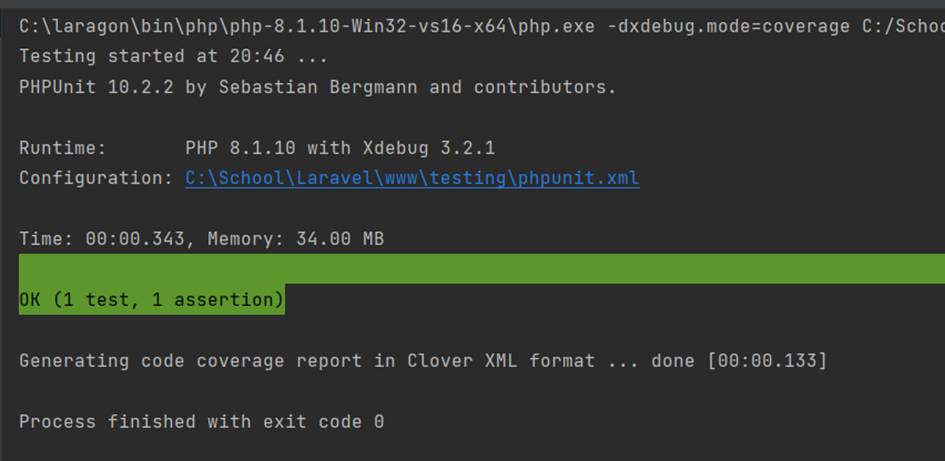

# Testplan
**User Story 1**

Als gebruiker wil ik in kunnen loggen op de applicatie met een wachtwoord die niet direct uit de database te halen valt, zodat ik minder snel gehackt kan worden

- Happy path: Het wachtwoord van de gebruiker en het wachtwoord in de database zijn niet hetzelfde
- Unhappy path: Het wachtwoord van de gebruiker en het wachtwoord in de database zijn hetzelfde.

**Unit test:** Tijdens de unit test ga ik controleren of het wachtwoord dat je opgeeft hetzelfde is als het encrypted wachtwoord, dit is om te checken of de encryptie goed werkt en het wachtwoord niet zomaar los opgeslagen wordt.

**System Test:** Tijdens de system test wordt getest hoe een wachtwoord daadwerkelijk in de database opgeslagen wordt, een user moet een account kunnen creëren. Vervolgens moet gecontroleerd worden of het wachtwoord in de database niet hetzelfde wachtwoord is als in dat de user opgegeven heeft.

**User Story 2**

Als gebruiker wil ik kunnen zien of mijn wachtwoord sterk genoeg is om mee te kunnen registreren, zodat ik niet eerst hoef te wachten op een foutmelding.

- Happy path: Het wachtwoord van de gebruiker is lang genoeg en kan gebruikt worden om mee in te loggen
- Unhappy path: Het wachtwoord van de gebruiker is te kort en de gebruiker kan er niet mee inloggen.

**Unit Test**: Tijdens de unit test ga ik controleren of het wachtwoord dat wordt opgegeven lang genoeg is.

**System Test**: Tijdens de system test wordt getest of een aangemaakte gebruiker in kan loggen op de pagina met zijn wachtwoord. Hiermee wordt gekeken of de gebruiker de applicatie kan gaan gebruiken.
# Code
## User Story 1
**Unit test:**

**System test:**

## User story 2
**Unit test:**

**System test:**

Description automatically generated](Aspose.Words.ba11cded-f45d-456f-aa63-fcd98b15d25e.005.png)
# Resultaat
**Unit test 1**

Het resultaat van de eerste unit test geeft een failure, dit is precies waar we naar zoeken. We willen namelijk niet dat het wachtwoord wat opgegeven wordt hetzelfde is als het wachtwoord dat encrypted is

**System test 1**

Ook hier geeft de code gelukkig een failure, dit geeft aan dat het opgegeven wachtwoord van de user niet hetzelfde wachtwoord is als het wachtwoord wat is opgeslagen in de database

**Unit test 2**

Deze test geeft geen failure, dit geeft aan dat het wachtwoord inderdaad een lengte heeft die groot genoeg is.

**System test 2**

Ook deze test geeft geen failure, wat aangeeft dat de gebruiker in kan loggen, de gebruiker wordt namelijk na het inloggen redirect naar /dashboard. Op het moment dat de gebruiker niet in kon loggen werd hij teruggestuurd naar het inlogscherm.

# Evaluatie
Door de tests kan worden aangetoond dat een wachtwoord niet werkt wanneer deze te kort is, de test tonen niet aan of het wachtwoord daadwerkelijk niet te ontcijferen is. Misschien hebben hackers wel een manier gevonden om de encryptie te ontcijferen en toch bij het wachtwoord te kunnen komen.

Voor de basis kunnen we nu wel controleren dat de gebruiker in kan loggen met zijn gegevens, voor de test is echter 1 statisch wachtwoord gebruikt, misschien zijn er wel opties om dit alsnog te omzeilen met een korter wachtwoord. Of misschien werkt de applicatie ook wel niet wanneer de user een te groot wachtwoord gebruikt, of tekens die niet mogen. Met een basis wachtwoord zoals ‘hallo123’ kan de gebruiker de applicatie veilig gebruiken.
